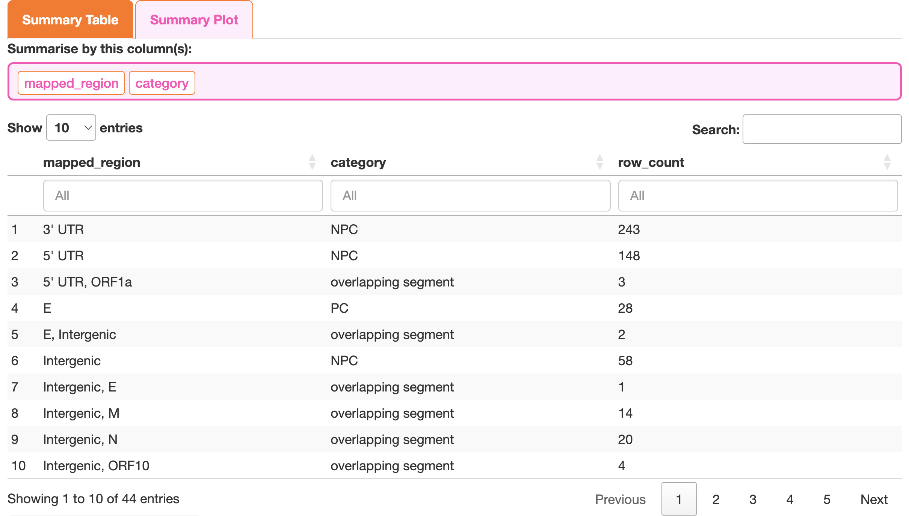

4. Front-End: Analysis
=======================

The Cas13 Platform was developed for the rapid identification of highly conserved and potent guides for therapeutics.

We have created a website to run the already processed data: 

Key Features
------------

- ✅ Run analyses interactively
- ✅ Export results for downstream use

Supported Virus Genera
^^^^^^^^^^^^^^^^^^^^^^^

**Currently available Genera:**

- Sarbecovirus
- Merbecovirus
- Enterovirus A71

**Currently availble Rule Types:**
 
- GG 
- NCP1 (Published Guide for SARS-CoV-2)
- ref (Collaborator request to ensure all the processed data guides exactly matched an in-house reference sequence)

.. note::
   
   Identify guides the Virologist, Immunologist etc. wishes to test. 
   The application detects the current Genera in the database. 

Application structure
---------------------

- Overview
- Analysis

Common Side Bar Features
^^^^^^^^^^^^^^^^^^^^^^^^

.. image:: img/0.common_sidebar.png
  :width: 200
  :alt: Alternative text

**Virus Genus:** contains the list of viral genus/subgenus in the frontend database

**Rule Type:** Showcases the types of rules processed. The default is the **GG** rule.

Drop down menu: Appearance Settings
"""""""""""""""""""""""""""""""""""

**Background & Grid**

- Theme preset: Light or Dark
    - This will reactively set the background to either black or white

- Backgroup Type: Colour or Transparent
    - The user has flexibility to downlaod the background of the graphs as either a designated colour or transparent, depending on the publication requirements

- Background colour
    - the user either select a colour from the grid, use the hexadecimal naming system or use a colour name (e.g., white)

- Grid Line Colour
    - Default: grey
    - the user either select a colour from the grid, use the hexadecimal naming system or use a colour name (e.g., grey)

**Text & Font**

- Font
    - The program uses the "FontHelper" package to find all the system fonts. They have been grouped by origin.
    - Default: Times New Roman 

- Axis Title Size
    - changes the x-axis and y-axis titles for all of the graphs
    - Default: 24

- Axis Text Size
    - changes the x-axis and y-axis tick marks for all of the graphs (e.g, tick marks)
    - Default: 20

- Text Colour
    - the user either select a colour from the grid, use the hexadecimal naming system or use a colour name (e.g., white)
    - Default: Black (Light theme) or White (dark theme)

- Strip Text Size
    - When the user splits the graph (e.g., Bar plot selected Split by header), the graphs will have a bar with the name of the split variable
    - Default: 24

**Legend**

- Legend Text Size
    - Changes the size of the listed variables
    - Default: 20

- Legend Title Size
    - Changes the size of the Legend Title, if present
    - Default: 30

- Legend Columns
    - The user can select the number of columns in the list of variables 
    - Default: 1

- Legend Location
    - The user can select the number of columns in the list of variables 
    - Default: none (Colouring and x-axis/y-axis are identical to remove redundancy) or right

**Colour Data**

- Colour by:
    - List all of the headers
    - Default: mapped_region

- Colouring Palette
    - The User can select their preferred starting colouring theme: default (R colouring defaults), rainbow, random, heat.colors, terrain.colors, topo.colors, hcl.colors, one
    - Default: default

- List of variables that can be coloured
    - Users can update the list as required 

.. image:: img/0.colour_changing.png
  :width: 100
  :alt: Alternative text

Common Main Panel Features
^^^^^^^^^^^^^^^^^^^^^^^^^^

- Each tab in the main panel will either have one graph or table. This is to ensure that the side bar panel remains next to the graph

- All graphs can be downloaded either as a PDF or PNG
    - PDF: Width and height can be altered
    - PNG: Width, height and resolution can be altered 

.. image:: img/0.Download.png
  :width: 800
  :alt: Alternative text

1. Overview
-----------

The goal of this section is to showcases what data is present in the application, and a summary table of the backend to the front end processing 

Side Bar Features
^^^^^^^^^^^^^^^^^

Bar Plot
""""""""

- Type of Plot
    - the user can display the data as either Counts (0 to ∞) or Proportions (0 to 1)
    - *Note: those with n=1 can be difficult to see the bar*

- Log Transform the counts?
    - Can use a log10 transformation of the count data so the extreme variables are less obvious 

    - *Note: those with n=1 will be 0 with log10 when transformation*

- Filter by: 
    - The user can choose to remove variables from the bar graph
    - Default: mapped_region

- X-axis:
    - The user can select the x-axis variable to display
    - Default: mapped_region

- Split by header:
    - The user can split the graph intot he various categories that is linked to the **Filter by:** heading

Main panel
^^^^^^^^^^

Database Summary
""""""""""""""""""""""""""

- the opening section shows the total number of guides presented for further filtering (Backend totals to available guides)

.. image:: img/0.overview.png
  :width: 800
  :alt: Alternative text

Guide Summary
"""""""""""""""""""""

**Summary Table** 

Allows the user to do an initial exploration of the data and see if their proteins and/or regions of interest are present in the database.

Additionally, this ensures that the scientist can extract the intial summary table for publication purposes.

- Summarise by this column(s): 
     - defaults: mapped_region and Category

Table

- summary statiscts based on the **summarise by this column(s)**
- Table is downloaded as a .csv file 

**Summary plot**

Purpose is to visulise the summary statistics of one column (x-axis) and coloured by a second variable if desired

The user can start with either **selecting all?** based on the *X-axis:* 

The user can then determine if they wish to filter out the variables within in the columns selected in *Filter by:*

*note: see* **bar plot** *side bar panel for customising the plot*

2. Analysis
---------------

Side Bar Features
^^^^^^^^^^^^^^^^^

Summary
"""""""

- Y-axis column:
    - The user can change what the y-axis is labelled as
    - Default: mapped_region

- Dot size
    - the user can visulise the dot size of any of the ML models
    - Default: mean_pred

- X-axis to display
    - the user can select which form of conservation was calculated 
        - Either exact or near
        - Sequence (seq), taxon (tax) or species 

Gene Filter
"""""""""""

- Filter to Category?
    - The user can select if they would like to remove the broader categorical data
       

- Types of categories:
    - PC (Protein-Coding)
    - NPC (Non-Protein-Coding; untrasnlated region[UTR] or intragenic)
    - overlapping segment (contains multiple categories)
        - This is based on the genomic order relative to the reference
        - If the gene overlapped the UTR and protein it would shoe in the mapped_region *UTR'5, ORF1a* or if it was protein-intregenic-protien, as *S, intragenic, N*
    -  Not mapped (NCBI did not include an annotation and our alignment tool could not determine the mapping)

- Select All Genes?
    - The user can select which genes that they want to include in their anaysis that is automatically rendered in the "Selected Gene(s):"

- Selected Gene(s):
    - shows the user which variables have been selected
    - The user can add/delete the variables of interest 

- Filter to Plotly Selection
    - This checkbox is automatically selected when the user clicks the conservarion graph area
    - It unselects when either the **Virus Genus** or **Rule** is changed

Silencing
""""""""""""""""""

- Filter Mean Prediction?
    - The user, if they wish, to filter to the mean silencing predictions

- Model to Filter:
    - the user can select the type of machine learning model
    - Default: mean_pred
        - Included: mean_pred (mean of the three top models), lasso (linear), CNN (neural network) and LSTM (neural network)

- y-axis
    - The user can select if they view the data as the mapped_region, category or genus
    - Default: mapped_region

Off-Target
""""""""""""""""""

- Remove human hits (off-target)?
    - Default: selected
    - The user can unselect if they wish to keep the off-target mapping to the hg38 human transcriptome 

Selected Guide(s)
""""""""""""""""""

- Filter to reference?
    - Depending on the goals of the user, they may wish to restrict the guide list to exactly match a reference

- Selected reference 
    - The user can select the reference sequence
    - Sarbecovirus default: NC_045512.2 which is the Wuhan reference strain 

- Sort by: 
    - This will order the **Filtered Table** list of the guides 
    - Default: mean_pred

- Limited total per mapped_region?
    - the user may only wish to keep guides to a restricted total 

- Filter by:
    - if the user wishes to restrict to a total per mapped_region. This column selects the feature for the order 
    - Default: mean_pred

- Max per mapped_region
    - total number of guides for a given mapped_region
    - Default: 10

Conservation Parameters
"""""""""""""""""""""""

- Conservation Type:
    - The user can select if the conservation was based on sequence, taxon or species depending on their research question
    - Default: Sequence conservation, based on the genus

- Dot Size 
    - The user can increase or decrease the size of the dots
    - Default: 2

Guide Loc. 
""""""""""

- Split by mapped_region
    - The user can visualise the **Guide Location** per the mapped_region or, if unselected, as the spatial relationship of guides

- Re-level guides?
    - In the Engine the levels are created to space out guides that overlap, and is time consuming in the whole dataset. Therefore we pre-calcualted the levels
    - After filtering to only a handful of guides, it maybe be worth releveling the graph, especially if there are few to no overlapping guides

- Height of guide:
    - The user can increase the height of the Bar
    - Default: 2

Motif
"""""

This links to the Coverage -> Guide + Target location 

- Choose colour Palette:
    - The user can chose to change the colour of the ATCG in the motif plot
        - Contains: Default, palettes (various), or custom  
    - Logo Palette 
        - Lists all of the available palettes
    - Custom:
        - can change the individual colours of A, T, G, C

Tree
""""

- Select Reference:
    - The user can select which reference to highlight on the phylogenetic tree plot
    - Sarbecovirus default: NC_045512.2 which is the Wuhan reference strain 

- Tree Label:
    - The user can chose how to label the outer most bar graph
    - Default: Genus

- Tree Layout:
    - The user can select what sort of layout of the phylogenetic tree. These are based on the 'ape' R package
    - Default: circular

- Tree edge thickness:
    - The line thickness of the phylogenetic tree
    - Default: 0.2

- Edge Colour
    - Colour of the lines
    - Default: black

- Bar thickness
    - Thickens of the inner and outer bar plots 
    - default 0.05

- Astrix
    - This highlights on the phylognetic tree the node of the selected reference
    - Default: Orange

- Astrix size
    - size of the astrix on the phylogenetic tree
    - Default: 10

- List of the colours of the conservation 
    - Exact (red), near (orange), no_match (light grey)
    - Rest of the colours are based on **Tree label**

Main panel
^^^^^^^^^^

The main panel is structure for exploring and filtering the guide data to extract the guides of interest

- Summary 
- Conservation 
- Silencing
- Off-Target
- Selected Guide(s)
- Guide Location
- Coverage
    - Motif
    - Tree
    - Matches (table)

Summary
""""""""""""""""""""""

This is the summary of the guide data of the genomic sequence and conservation. This allows the user to explore which genes or regions are conserved and if they wish to proceed with guide selection. 

- top bar to showcase the specific values of a 'clicked on' guide

- Main balloon plot
    - The default of the mapped_region (genomic order based on the reference e.g., NC_045512.2 Wuhan reference strain ) vs the conservation (sequence)
    - See side bar panel **Summary** and **Appearance Settings** to customise the graph

Conservation
"""""""""""""""""""""""""

This graph showcases the conservation of the exact (x-axis) vs near (y-axis) matches 
 
- Each dot represents a unique guide
- top bar to showcase the specific values of a 'clicked on' guide
- The user can select the region on the graph of interest for the first filtering stage
- The graph will show the outcomes of the filtering choices from **Gene Filter** in the side bar column (automatically opens on this tab)

Silencing
""""""""""""""""""""""""

This section showcases the predicted silencing of any given guide 

- The x-axis show the silencing (0 to 1). 1 = predicted to have high silencing and 0 = no silencing
- The y-axis is the remaining mapped_regions from the previous section
- Tick the **Filter Mean** if you wish to use this parameter in the **Additional Fitlers** 

- For customising the y-axis look under the "Silencing" section in the side bar panel

Off-Target
""""""""""

To ensure that off-target effects are limited, we pre-calculated if the guides could potentially map to the hg38 build of the human transcriptome. The guides were blasted against the human transcriptome using the "Blastn" function. However, a limitation of this is the matched regions are sequential rather than sporatic. So, partial matches may still exist. 

- List to remove as potential off-target effects
    - The user can select which sort of 'off-target' mismatches need to be selected.
    - The categories are mismatches and or gap idenification 
    - Default: up to 5 mismatchs and 2 nt gaps present 

- the user needs to unselect the **Remove human hits (off-target)?** if they do not wish to include this setting

Selected Guide(s)
""""""""""""""""""

This table shows how many guides remain after conservation, silencing and off-target filtering

- Additional filters:
    - Filter to reference
    - Limit total per mapped_region

- OThe user Parameters
    - see **Additional Filters** 

The final list of guides for the remaining analysis

The downloaded Table can be used for the **Experimental Design** section

Guide Location
"""""""""""""""

This section showcases the location of the guide in the genome. Each bar is 30bp long.

- The Default is to split the grpah by the mapped_region 
- The user may decided to go back and refine which genes/regions to select, if needed before doing each guide specific interrogation

Coverage 
""""""""""

Guide + Target
~~~~~~~~~~~~~~~~~~~~~

The user will need to click the "Load Guides" in the side bar panel to render those remaining from the Filtered Table, which will render the list in the "Select Guide:"

The order of the Gudies will be based on **Sort by:** in the **Additional Filters** section. 

- The motif plot(s)
    - Top: The selected guide 
    - Bottom: the Target sequence (e.g., Genomic sequence in +sense single strandard RNA virus) that inclues the exact as well as near matches for what the guide will potentially conservarion

- Table 
    - All associated information of the guide in the motif plot

Tree
~~~~~~~

To understand the overall coverage of any given guide in the phylogenetic tree. The tree was built in iqTree based on the whole sequence.

- The user can customise the graph sidebar panel **Tree** 

- The user can collapse the tree in the area's of high redundancy
    - However, there may still be near matches present in some of these highly similar sequences

- The graph has the Title as the Guide sequence and prints the Predicted silencing

- Features of the Graph:
    - inner area is the phylogenetic tree
    - Middle bar graph is the coverage of the guide: exact, near and no_match
    - Outer layer is based on the **Tree lable** with the default being the Genus

Matches (Table)
~~~~~~~~~~~~~~~~~~~~~~~~~~~~

This table showcases where the guide mapped to. This enables the reserach to check the species of origin, (e.g., Bat in Sarbecovirus) and allows them to go back to the NCBI website if they wish to look at additional inforamtion not present in this tool. 

- The Defaults:
    - ID: the NCBI numeric search ID
    - Organism: NCBI organism classification 
    - Acession_ID: NCBI accession ID

